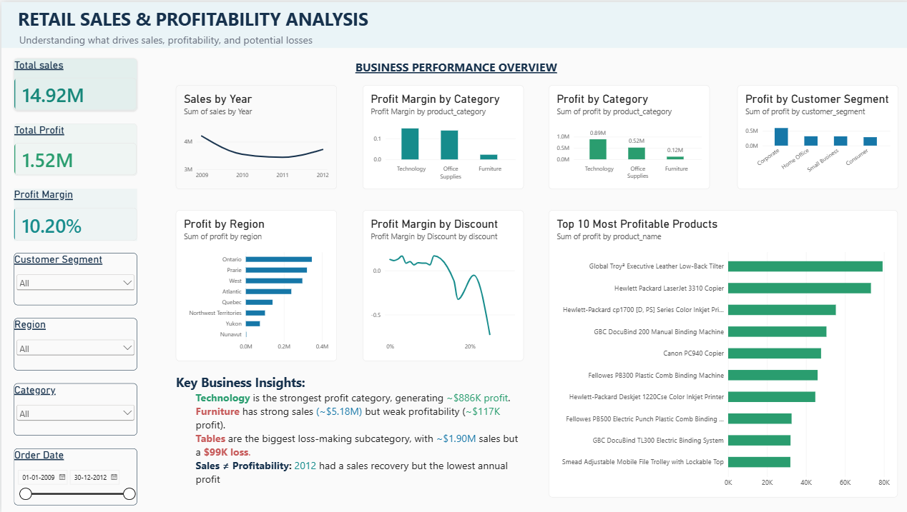

## 📌 Project Overview

This project analyzes retail sales data to understand what is driving sales and profitability, and to identify areas where the company may be losing money.

The analysis focuses on the relationship between:

**Sales → Customers → Products → Regions → Discounts → Profit**

The goal is to move beyond simply looking at sales and determine which products, categories, regions, and customer segments are actually contributing to profitability.

## 🎯 Business Problem

The company has strong sales but wants to understand what is actually driving profitability and where it is losing money.

The analysis aims to answer questions such as:

- Which product categories generate the most profit?
- Which subcategories contribute to losses?
- How does profitability change across years?
- Which regions and customer segments perform best?
- How does discounting relate to profitability?
- Which products are consistently loss-making?

## 🎯 Project Objectives

- Analyze overall sales and profit performance.
- Identify the most and least profitable product categories.
- Investigate subcategories contributing to losses.
- Compare profitability across regions and customer segments.
- Examine the relationship between discounts and profit margins.
- Identify highly profitable and loss-making products.
- Build an interactive Power BI dashboard to communicate the findings.

### 1. 🛠️ Tools & Technologies

- **Python** — Data cleaning and preprocessing
- **Pandas** — Data manipulation and validation
- **SQL** — Business analysis and profitability analysis
- **PostgreSQL** — Data storage and querying
- **Power BI** — Interactive dashboard and visualization

### 2. 📊 Dataset

The dataset contains **8,399 retail transaction records** across **21 columns**.

The data includes information about:

- Orders and order dates
- Customers and customer segments
- Products and product categories
- Sales, quantity, discounts, and profit
- Regions and provinces
- Shipping modes and shipping costs

### 3. 🔄 Project Workflow

1. **Data Collection**
   - Loaded the raw retail sales dataset.

2. **Data Cleaning**
   - Cleaned column names.
   - Handled data types.
   - Converted date columns to the appropriate format.
   - Checked for missing values and duplicates.
   - Saved the cleaned dataset.

3. **SQL Analysis**
   - Loaded the cleaned data into PostgreSQL.
   - Analyzed sales, profit, and profit margins.
   - Investigated categories, subcategories, regions, customers, discounts, and products.
   - Identified profitable and loss-making areas.

4. **Power BI Visualization**
   - Connected Power BI to PostgreSQL.
   - Created KPI cards, charts, and interactive filters.
   - Built a dashboard focused on sales and profitability.

### 4. 💡 Key Insights
- **Technology** was the most profitable product category, generating approximately **$886K in profit** from around **$5.98M in sales**.

- **Furniture** generated approximately **$5.18M in sales**, but only around **$117K in profit**, showing significantly weaker profitability compared with Technology and Office Supplies.

- Within Furniture, **Tables** were the largest loss-making subcategory, generating approximately **$1.90M in sales** but a **$99K loss**, with a profit margin of approximately **-5.22%**.

- **Bookcases** were also loss-making, generating approximately **$823K in sales** and a loss of around **$33.6K**, with a profit margin of approximately **-4.08%**.

- **Sales and profitability did not always move together across years.** In 2012, sales recovered compared with the previous year, but total profit was the lowest among the four years analyzed.

- The analysis shows that **high sales volume does not necessarily translate into high profitability**, making profit margin an important metric for evaluating business performance.

### 5. 📈 Dashboard
The interactive Power BI dashboard provides a consolidated view of the company's sales performance and profitability.

### Dashboard Components

- **Total Sales** — Overall revenue generated.
- **Total Profit** — Overall profit generated.
- **Profit Margin** — Profit as a percentage of sales.
- **Sales by Year** — Tracks sales performance over time.
- **Profit by Category** — Compares profitability across product categories.
- **Profit Margin by Category** — Highlights differences in profitability efficiency.
- **Profit by Region** — Compares profitability across regions.
- **Profit Margin by Discount** — Examines profitability across different discount levels.
- **Profit by Customer Segment** — Compares profitability across customer segments.
- **Top 10 Most Profitable Products** — Identifies products contributing the most profit.

### Interactive Filters

The dashboard includes filters for:

- Customer Segment
- Region
- Product Category
- Order Date

### 6. 💼 Business Recommendations

Based on the analysis, the following actions could help improve profitability:

- **Investigate Tables and Bookcases:** These subcategories generated losses despite significant sales. The company should review their pricing, costs, and discounting strategies.

- **Focus on profitable categories:** Technology showed the strongest profitability and could be examined for opportunities to expand sales while maintaining healthy margins.

- **Monitor profit margins alongside sales:** High sales alone do not guarantee strong financial performance. Profit and profit margin should be tracked when evaluating products and categories.

- **Review loss-making products:** Products generating repeated losses should be investigated to determine whether pricing, discounts, shipping costs, or operating costs are contributing to poor performance.

- **Use discounting strategically:** Discounts should be evaluated based on their effect on profitability rather than sales volume alone.

### 7. 📁 Project Structure

Retail_Sales_Profitability_Analysis/
│
├── data/
│   ├── raw/
│   │   └── superstore.csv
│   └── processed/
│       └── superstore_clean.csv
│
├── notebooks/
│   └── sales_analysis.ipynb
│
├── sql/
│   └── business_analysis.sql
│
├── powerbi/
│   └── sales_profitability_dashboard.pbix
│
├── dashboard.png
└── README.md

